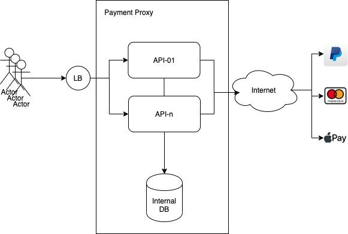

# Transactional Demo Project

This is a sample project showing problems you can have in a *proxy* application without taking care to a possible catastrophic problem.

A medium article explaining all the steps will come...

## Sample Architecture

The final product is simulating a Payment Proxy:
* Exposes a payment API to process Payment
* Stores the payment transaction and its status into the database
* Call the external provider to process the payment

> For demo purposes the external provider is mocked using an internal API.

## APIs

### /v1/mock
This API is used to simulate the external payment.

```
curl --location --request GET 'http://localhost:8080/v1/mock'
```

As it is an external server, you can have delay related to network TTL or even due to performances of the external service. If you want to simulate a possible real case you can add the `delay=true` parameter. With this call the API will randomly choose a response time between 1s and 40s (!!).

```
curl --location --request GET 'http://localhost:8080/v1/mock?delay=true'
```

### POST /v1/payments

This is the main API of this application allowing customer to apply payments.
```
curl --location --request POST 'http://localhost:8080/v1/payments' \
--header 'Content-Type: application/json' \
--data-raw '{
   "amount": 10,
   "orderId": "Order123"
}'
```

> **NOTE**: This API is simulating an external call via the Mock API and the call can take up to 40s !

### GET /v1/payments

To retrieve the list of the processed payment transactions

```
curl --location --request GET 'http://localhost:8080/v1/payments'
```


